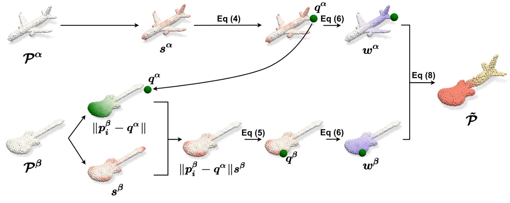

# SageMix: Saliency-Guided Mixup for Point Clouds
Official Implementation (PyTorch) of SageMix, (NeurIPS 2022). ([Arxiv](https://arxiv.org/abs/2210.06944))
> Sanghyeok Lee<sup>1*</sup>, Minkyu Jeon<sup>1*</sup>, Injae Kim<sup>1</sup>, Yunyang Xiong<sup>2</sup>, Hyunwoo J. Kim<sup>1†</sup>.  
> <sup>1</sup>Korea University <sup>2</sup>Meta Reality Labs



## Usage
- See [pointcloud](https://github.com/mlvlab/SageMix/tree/main/pointcloud) for point cloud processing.
- The code and models for 2D Image classification will come soon.

## License
Licensed under [MIT License](https://github.com/mlvlab/SageMix/blob/main/LICENSE)
> Copyright (c) 2022 MLV Lab (Machine Learning and Vision Lab at Korea University)

## Citation
If you find this code useful for your work, please consider citing:
```
@InProceedings{lee2022sagemix,
    title     = {Point Cloud Augmentation With Weighted Local Transformations},
    author    = {Sanghyeok Lee and 
                 Minkyu Jeon and
                 Injae Kim and 
                 Yunyang Xiong and 
                 Hyunwoo J. Kim},
    booktitle = {Advances in Neural Information Processing Systems},
    year      = {2022}
}
```
